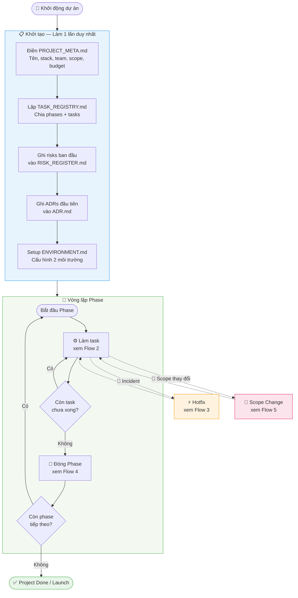
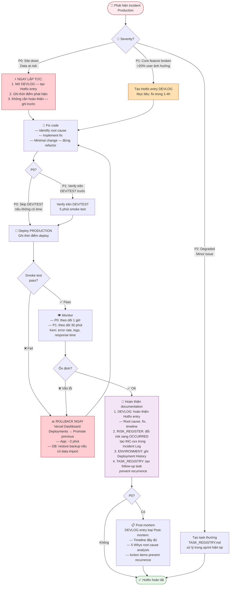
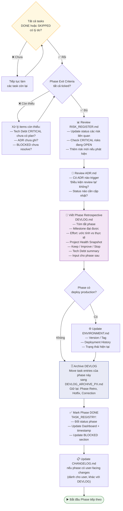
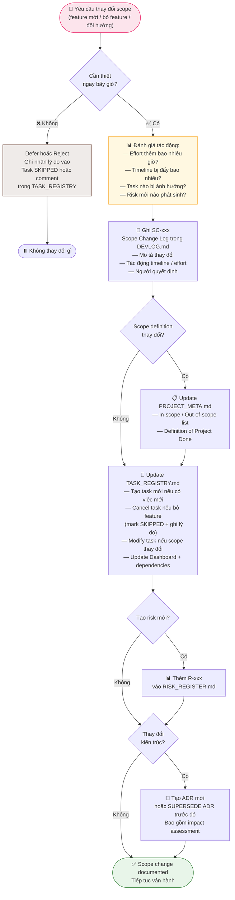
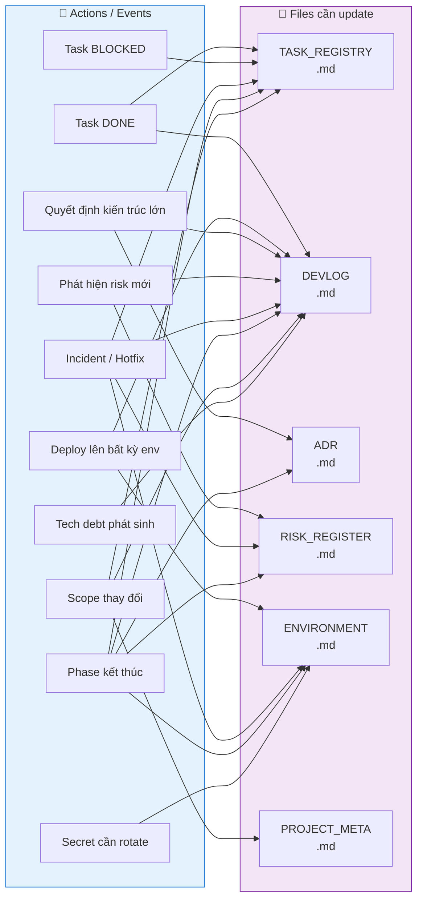

# FLOW — Sơ Đồ Vận Hành Dự Án
> Đọc file này để hiểu toàn bộ quy trình vận hành. Render tốt nhất trên: **Obsidian, GitHub, GitLab, VSCode (Markdown Preview Mermaid)**

---

## 1. TỔNG QUAN VÒNG ĐỜI DỰ ÁN

---

## 2. TASK LIFECYCLE — Vòng đời một task

```mermaid
flowchart TD
    CREATE["📝 Tạo task\nTASK_REGISTRY.md\nĐiền đủ: Type, DoR, Bối cảnh,\nYêu cầu, Output, Goal, DoD"] --> DOR

    DOR{"✅ Tick đủ\nDefinition of Ready?"}
    DOR -->|"❌ Chưa đủ"| BLOCKED["🔴 Status: BLOCKED\n— Ghi vào bảng ⚠️ BLOCKED\n— Ghi lý do blocked\n— Đặt action để unblock"]
    BLOCKED -->|"Dependency resolved"| DOR
    DOR -->|"✅ Đủ"| INPROG["🔵 Status: IN_PROGRESS\nGhi Ngày bắt đầu + HH:mm +07"]

    INPROG --> WORK["⚙️ Làm việc..."]

    WORK --> AI_CHECK{"Dùng AI\ngenerate code?"}
    AI_CHECK -->|Có| AI_REVIEW["🤖 AI Code Review:\n— Verify không hallucinated API\n— Check error handling\n— Test logic với test case thực\n— Lưu prompt quan trọng"]
    AI_CHECK -->|Không| ARCH_CHECK
    AI_REVIEW --> ARCH_CHECK

    ARCH_CHECK{"Có quyết định\nkiến trúc lớn?"}
    ARCH_CHECK -->|Có| ADR["📘 Ghi ADR.md\nADR-xxx"]
    ARCH_CHECK -->|Không| RISK_CHECK
    ADR --> RISK_CHECK

    RISK_CHECK{"Phát sinh\nrisk mới?"}
    RISK_CHECK -->|Có| RISK["📊 Ghi RISK_REGISTER.md\nR-xxx với Inherent/Residual score"]
    RISK_CHECK -->|Không| DEPLOY_CHECK
    RISK --> DEPLOY_CHECK

    DEPLOY_CHECK{"Cần\ndeploy?"}
    DEPLOY_CHECK -->|Có| DEPLOY["🚀 Chạy deploy checklist\nUpdate ENVIRONMENT.md\nGhi Deployment History"]
    DEPLOY_CHECK -->|Không| REVIEW
    DEPLOY --> REVIEW

    REVIEW["🔍 Status: IN_REVIEW\n— Solo: self-review sau 2h\n— Team: peer review\n— AI code: checklist riêng"]
    REVIEW --> DOD{"✅ Tick đủ\nDefinition of Done?"}
    DOD -->|"❌ Chưa đủ"| INPROG
    DOD -->|"✅ Đủ"| DEVLOG

    DEVLOG["📓 Viết DEVLOG entry\n— Những gì đã làm / KHÔNG làm\n— Output thực tế vs kỳ vọng\n— Tech Debt mới\n— Security Audit\n— KB Notes → cập nhật KB INDEX"]

    DEVLOG --> DONE["✅ Status: DONE\n— Ghi Ngày hoàn thành + HH:mm +07\n— Ghi Effort thực tế\n— Update Dashboard\n— Xóa khỏi BLOCKED nếu có\n— Trigger tasks bị unblock"]

    style CREATE fill:#e3f2fd,stroke:#1976D2
    style BLOCKED fill:#ffebee,stroke:#c62828
    style INPROG fill:#e8eaf6,stroke:#3949AB
    style REVIEW fill:#fff8e1,stroke:#F9A825
    style DONE fill:#e8f5e9,stroke:#2E7D32
    style ADR fill:#e8eaf6,stroke:#5C6BC0
    style RISK fill:#fce4ec,stroke:#C2185B
    style DEVLOG fill:#f3e5f5,stroke:#7B1FA2
```

---

## 3. HOTFIX FLOW — Xử lý sự cố production

---

## 4. PHASE CLOSURE — Đóng một phase

---

## 5. SCOPE CHANGE FLOW — Khi scope thay đổi

---

## 6. FILE INTERACTION MAP — Action nào → Update file nào

---

## 7. DAILY / WEEKLY ROUTINE

```mermaid
flowchart TD
    subgraph DAILY ["☀️ Đầu ngày làm việc — 5 phút"]
        D1["👁️ Nhìn vào\n⚠️ BLOCKED section\nTASK_REGISTRY"] --> D2["📊 Check Dashboard\nTask nào đang IN_PROGRESS?"] --> D3["🎯 Chọn task ưu tiên\ncao nhất để làm hôm nay"]
    end

    subgraph AFTER_TASK ["✅ Sau mỗi task DONE — 15-30 phút"]
        T1["Tick DoD checklist"] --> T2["Viết DEVLOG entry\nkể cả entry ngắn"] --> T3["Update KB INDEX\nnếu học được gì"] --> T4["Update Dashboard\nvà BLOCKED section"]
    end

    subgraph WEEKLY ["📅 Cuối tuần / Sau mỗi phase — 30-60 phút"]
        W1["Review RISK_REGISTER\nCRITICAL risks vẫn OPEN?"] --> W2["Review ADR\nCó điều kiện review nào triggered?"] --> W3["Check Budget\nPROJECT_META cost tracking"] --> W4["Phase Retro nếu phase vừa đóng"]
    end

    subgraph BEFORE_PROD ["🚀 Trước mỗi deploy PRODUCTION"]
        P1["Tick toàn bộ\nPRODUCTION checklist\nENVIRONMENT.md"] --> P2["Smoke test DEV/TEST\npass chưa?"] --> P3["Deploy + Monitor\ntheo window tương ứng"]
    end

    style DAILY fill:#e3f2fd,stroke:#1976D2
    style AFTER_TASK fill:#e8f5e9,stroke:#2E7D32
    style WEEKLY fill:#fff8e1,stroke:#F9A825
    style BEFORE_PROD fill:#fce4ec,stroke:#E91E63
```

---

## 8. LEGEND — Bảng màu và ký hiệu

| Màu node | Ý nghĩa |
|----------|---------|
| 🔵 Xanh dương nhạt | Start / Tạo mới |
| 🟢 Xanh lá nhạt | Hoàn thành / Done |
| 🔴 Đỏ nhạt | Lỗi / Blocked / Nguy hiểm |
| 🟡 Vàng nhạt | Đang xử lý / Warning |
| 🟣 Tím nhạt | Documentation / File update |
| 🟠 Cam nhạt | Hotfix / Urgent |

| Ký hiệu | Ý nghĩa |
|---------|---------|
| `-->` | Flow bình thường |
| `-.->` | Flow đặc biệt / exception |
| `{}` | Decision point |
| `([])` | Start / End |
| `[]` | Process / Action |
| `subgraph` | Nhóm các bước liên quan |

---

> **Tip:** Render file này trong **Obsidian** (cài plugin Mermaid) hoặc paste từng diagram lên [mermaid.live](https://mermaid.live) để xem trực quan.
