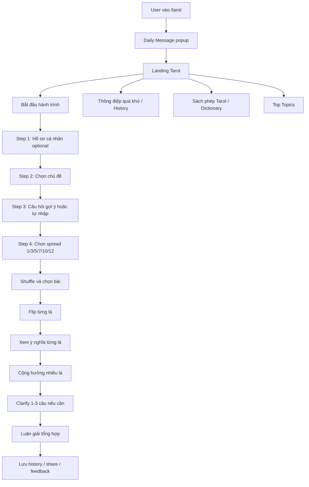

# Bản Mệnh V2 Product Spec

Ngày cập nhật: 2026-05-13

Mục tiêu: rebuild song song Bản Mệnh thành một nền tảng module hóa, có môi trường dev/test và production riêng, payment/entitlement rõ ràng, KB được bảo mật, đồng thời tránh lặp lại tình trạng file lớn, code rác và tech debt.

## 1. Mục Tiêu

- Tách từng module thành route riêng.
- Mỗi module có pricing, user journey và entitlement riêng.
- Backend là nguồn quyết định quyền truy cập, không tin frontend.
- KB/raw content không nằm trong static frontend.
- Không lưu secret/token/API key trong repo.
- Tất cả thay đổi phải đi qua dev/test trước khi go-live production.

## 2. Routes

```text
/                  Hub chính
/than-so-hoc       Module Thần số học
/tarot             Module Tarot
/pricing           Tổng hợp gói
/account           Tài khoản, lịch sử, quyền đã mua
/legal/privacy     Chính sách bảo mật
/legal/terms       Điều khoản dịch vụ
/support           Hỗ trợ
```

## 3. Module Thần Số Học

### Free

- Nhập họ tên và ngày sinh.
- Xem bản tóm tắt giới hạn.
- Không xem đủ 30 chỉ số.
- Không lưu/tải báo cáo đầy đủ.

### Paid

Mô hình đề xuất:

- `49.000đ / 1 bản luận giải`.
- Quyền mua gắn với một bộ input: họ tên + ngày sinh.
- Sau khi mua, user xem lại bản đó vĩnh viễn trong tài khoản.

Entitlement:

```ts
{
  module: "numerology",
  type: "single_report",
  reportId: "report_...",
  paidAt: "...",
  lifetime: true
}
```

## 4. Module Tarot

### 4.1 Định Vị

Tarot V2 không nên chỉ là “rút bài”. Module này cần được thiết kế như một hệ sinh thái Tarot nhỏ:

- Daily Message.
- Reading Wizard.
- Spread Engine.
- Tarot Dictionary.
- Reading History.
- Community Topics / Trend Insight.
- Manual Spread Analyzer.

Nguồn tham khảo workflow: Mystery Tarot public website. Chỉ tham khảo cấu trúc hệ thống, data layers và user journey; không copy code, artwork, nội dung luận giải, nhận diện thương hiệu hoặc asset.

### 4.2 Cấu Trúc Hệ Thống Tarot

Route `/tarot` gồm các phần:

- Landing Tarot riêng.
- Daily Message popup đầu phiên.
- CTA chính: Bắt đầu hành trình.
- CTA phụ: Thông điệp quá khứ / Lịch sử trải bài.
- CTA phụ: Sách phép Tarot / Từ điển 78 lá.
- Top Topics: tổng hợp các chủ đề user đang quan tâm.
- Reading Wizard 4 bước.
- Reading page: shuffle, chọn lá, flip lá, xem ý nghĩa từng lá.
- Result page: luận giải từng lá, cộng hưởng nhiều lá, tổng hợp cuối.
- Manual Spread Analyzer: user tự xếp bộ bài vật lý rồi nhập vào hệ thống để phân tích.

### 4.3 Database / KB Tarot

KB Tarot phải tách riêng thành các lớp:

```text
tarot_kb/
  cards/
    cards.json
  taxonomy/
    themes.json
    spread_types.json
    preset_questions.json
  combos/
    combo_index.json
    details/*.json
  daily/
    daily_messages.json
  clarify/
    clarify_questions.json
  assets/
    card_manifest.json
```

Yêu cầu KB:

- Card KB: 78 lá, tên EN/VI, arcana, suit, số, keyword xuôi/ngược, nghĩa tổng quát.
- Aspect KB: nghĩa theo chủ đề như love, ex, current_love, career, finance, health, self, decision.
- Spread KB: 1/3/5/7/10/12 lá, mô tả vai trò từng vị trí.
- Preset Question KB: câu hỏi gợi ý theo từng chủ đề.
- Combo KB: cộng hưởng 2/3/4/5 lá, có index và detail lazy-load.
- Daily KB: nhiều thông điệp ngày mới theo lá và chiều xuôi/ngược.
- Clarify KB: câu hỏi làm rõ trước khi tổng hợp luận giải.

Bảo mật:

- KB không được public trong static build.
- Frontend chỉ gọi `/api/kb/tarot/...` qua auth/entitlement phù hợp.
- Build smoke test phải fail nếu artifact có `tarot_knowledge_base.json`, raw decoded file, hoặc KB private.

### 4.4 User Journey Tarot



### 4.5 Daily Message

Mục tiêu:

- Tạo retention loop hằng ngày.
- Tạo cảm giác “web có sự sống”, không chỉ là công cụ tra cứu.

Hành vi:

- Hiện popup đầu phiên nếu user chưa xem daily message trong ngày.
- User chạm vào lá bài để reveal.
- Hiện streak/progress.
- Có CTA quay lại mỗi ngày.
- Không chặn user dùng tính năng chính nếu họ đóng popup.

Data:

```ts
{
  userId?: string,
  date: "YYYY-MM-DD",
  cardId: number,
  reversed: boolean,
  message: string,
  streakCount: number
}
```

### 4.6 Top Topics

Mục tiêu:

- Social proof: cho user thấy người khác đang quan tâm gì.
- Giải quyết “không biết hỏi gì”.
- Làm đầu vào cho gợi ý câu hỏi/chuyển đổi.

Data:

```ts
{
  theme: "career" | "future_love" | "current_love" | "...",
  count: number,
  percentage?: number,
  cachedAt: string
}
```

Yêu cầu:

- Chỉ show aggregate, không show câu hỏi cá nhân.
- Cache để tránh query nặng.
- Không làm lộ private prompt/user content.

### 4.7 Reading Wizard

Step 1 - Hồ sơ cá nhân:

- Tên gọi: optional nhưng khuyến khích.
- Ngày sinh/giới tính: optional, dùng để cá nhân hóa.
- Nếu thu thập ngày sinh/giới tính, cần privacy copy rõ ràng.

Step 2 - Chủ đề:

- Nhóm chính: Tình yêu, Sự nghiệp, Tài chính, Sức khỏe/tinh thần, Bản thân, Tổng quát.
- Sub-theme: người cũ, người hiện tại, crush, mối quan hệ mập mờ, xin việc, thăng tiến, đầu tư, nợ nần, quyết định, v.v.

Step 3 - Câu hỏi:

- Tab câu hỏi gợi ý theo chủ đề.
- Tab tự nhập.
- Giới hạn 200-300 ký tự.
- Cần có validate spam/toxic/tối nghĩa nếu gọi AI.

Step 4 - Spread:

Free/basic:

- 1 lá: thông điệp trực diện.
- 3 lá: quá khứ - hiện tại - tương lai.

Paid/deeper:

- 5 lá: tình huống - thách thức - lời khuyên - ngoại cảnh - kết quả.
- 7 lá: Celtic rút gọn / hành trình sâu.
- 10 lá: Celtic Cross đầy đủ.
- 12 lá: 12 nhà/12 lĩnh vực.

### 4.8 Reading Experience

Yêu cầu:

- Render bộ 78 lá úp.
- User tự chọn lá, không auto random hết.
- Sau khi đủ số lá, xếp vào layout spread.
- User flip từng lá.
- Mỗi lá có panel ý nghĩa: vị trí, xuôi/ngược, keyword, nghĩa theo chủ đề.
- Sau khi flip hết, mới hiện nút xem luận giải tổng hợp.

Không nên:

- Trả kết quả ngay sau khi user bấm submit.
- Bỏ qua nghi thức shuffle/chọn/flip.

### 4.9 Result Structure

Kết quả nên có các tầng:

1. Tổng quan năng lượng.
2. Ý nghĩa từng vị trí.
3. Ý nghĩa từng lá theo chủ đề.
4. Cộng hưởng nhiều lá.
5. Trả lời trực tiếp câu hỏi.
6. Lời khuyên hành động.
7. Điều cần tránh.
8. Gợi ý trải bài tiếp theo.
9. Disclaimer: tham khảo/tự phản tỉnh, không thay thế y tế, pháp lý, tài chính, tâm lý chuyên môn.

### 4.10 Manual Spread Analyzer

Mục tiêu:

- Phục vụ user có bộ bài vật lý.
- Tăng giá trị cho tier cao.

Flow:

1. Chọn spread.
2. Chọn từng lá từ card picker.
3. Toggle xuôi/ngược.
4. Chọn chủ đề.
5. Nhập câu hỏi optional.
6. Hệ thống phân tích.

Nên xếp vào Master tier hoặc add-on premium.

### 4.11 History

Free:

- Local history giới hạn.

Guide/Master:

- Cloud history.
- Filter theo ngày/chủ đề.
- Xem lại result.
- Xóa từng reading / xóa tất cả.

Data:

```ts
{
  id: string,
  userId?: string,
  theme: string,
  question?: string,
  spread: 1 | 3 | 5 | 7 | 10 | 12,
  cards: Array<{ cardId: number; reversed: boolean; position: number }>,
  analysis?: string,
  createdAt: string
}
```

### 4.12 Pricing Tarot

Bản Mệnh V2 thiết kế pricing Tarot mới theo module/tier.

Nếu sau này cần hỗ trợ import quyền/gói ngoài scope:

- Phải tạo task và ADR riêng.
- Phải có danh sách dữ liệu cần chuyển.
- Phải có chính sách thông báo rõ cho user.
- Không được tự thêm vào MVP.

Đề xuất tier mới:

Free:

- Daily message.
- 1/3 lá với giới hạn hợp lý.
- Từ điển 78 lá cơ bản.
- History local.

Guide:

- `29.000đ/tháng` hoặc giá sẽ chốt sau.
- 1/3/5/7 lá.
- History cloud.
- Preset questions theo chủ đề.
- Luận giải tổng hợp sâu hơn.
- Không quảng cáo/noise.

Master:

- `109.000đ/tháng` hoặc giá sẽ chốt sau.
- Tất cả Guide.
- 10/12 lá.
- Manual Spread Analyzer.
- Combo analysis nâng cao.
- Tarot journal cá nhân.
- Trend/insight cá nhân theo thời gian.

Entitlement:

```ts
{
  module: "tarot",
  tier: "free" | "basic_lifetime" | "guide" | "master",
  startsAt?: string,
  expiresAt?: string,
  lifetime?: boolean,
  status: "active" | "expired" | "cancelled"
}
```

### 4.13 AI / Non-AI Decision

Quyết định đã chốt cho MVP:

- Tarot MVP dùng KB + template engine, không gọi Gemini/OpenAI cho phần luận giải.
- Định vị giai đoạn đầu: “tri thức chuyên gia / kho tri thức nội bộ”, không claim AI.
- AI chỉ là optional future feature cho tier cao sau khi có spec riêng.

Ràng buộc:

- Nếu sau này dùng Gemini/OpenAI cho Tarot, phải đổi positioning thành “AI hỗ trợ diễn giải cá nhân hóa”.
- Khi bật AI, phải cập nhật Privacy/Terms và nói rõ dữ liệu câu hỏi có thể được gửi sang bên thứ ba.
- Không được vừa gọi AI vừa dùng claim “Không AI”.
- Xem thêm `technical-decisions.md` DR-003.

## 5. Payment

API đề xuất:

```text
POST /api/payment/create
GET  /api/payment/check
POST /api/payment/webhook
POST /api/vouchers/validate
GET  /api/entitlements
```

Yêu cầu:

- Webhook verify signature.
- Payment confirm idempotent.
- Order status: `pending`, `confirming`, `confirmed`, `failed`, `expired`.
- Log payment.
- Telegram alert cho lỗi và payment success.
- Voucher có `maxUses`, `perUserLimit`, `expiresAt`, `active`.

## 6. Data Model

```text
users
reports
purchases
entitlements
vouchers
payment_logs
tarot_readings
tarot_daily_draws
tarot_topic_stats
```

## 7. Security Requirements

- Không commit secret/token/API private key.
- KB chỉ nằm trong Worker/KV/private storage.
- Static build không chứa KB/raw content.
- Admin API bắt buộc auth.
- `/api/kb/*` no auth phải trả `401`.
- Admin API no token phải trả `401`.
- CSP không dùng `unsafe-inline` nếu có thể.
- Không inline `onclick` trong bản mới.
- Có script scan secret và scan artifact trước deploy.

## 8. Environments

Dev/Test:

```text
dev.banmenh.online
banmenh-payment-dev
PAYMENTS_DEV
Firestore dev hoặc collection namespace dev
Cloudflare KV/R2 dev cho KB/cache
Telegram alert dev
```

Production:

```text
banmenh.online
banmenh-payment
PAYMENTS_PROD
Firestore production
Cloudflare KV/R2 production cho KB/cache
Telegram alert production
```

Quyết định stack/storage đã chốt:

- Frontend: Next.js + TypeScript.
- API/payment/admin/kb gateway: Cloudflare Workers.
- User/transaction data: Firestore.
- KB/cache/manifest: Cloudflare KV/R2.
- Xem thêm `technical-decisions.md` DR-001 và DR-002.

## 9. Repo Structure

```text
apps/
  web/
    src/
      routes/
      modules/
        numerology/
        tarot/
        account/
        pricing/
      components/
      styles/
      lib/
workers/
  payment/
  kb/
  admin/
packages/
  shared/
    pricing.ts
    entitlements.ts
    schemas.ts
    constants.ts
docs/
  product-spec.md
  architecture.md
  security-checklist.md
  release-checklist.md
  payment-flow.md
```

## 10. Definition Of Done

- Build pass.
- Typecheck pass.
- Security smoke pass.
- Route refresh không 404.
- Mobile layout không vỡ.
- Không có secret trong diff.
- Không có KB trong static artifact.
- Có loading/error/empty state.
- Payment/entitlement có test nếu dùng money flow.
- Có rollback note.

## 11. Release Checklist

```text
[ ] Dev deploy pass
[ ] Login pass
[ ] Free flow pass
[ ] Paid flow pass
[ ] Voucher pass
[ ] Payment success pass
[ ] Payment expired/fail pass
[ ] Telegram alert pass
[ ] /api/kb no auth = 401
[ ] Admin no token = 401
[ ] KB direct static URL không lộ
[ ] Mobile check
[ ] Legal copy reviewed
[ ] Production deploy approved
```

## 12. AI Roles

- Codex: main builder / architect / deploy owner.
- Claude: QC/Audit only, không sửa code trực tiếp, không giữ secret, không deploy.
- Product owner: duyệt business model, pricing, nội dung, go-live.
